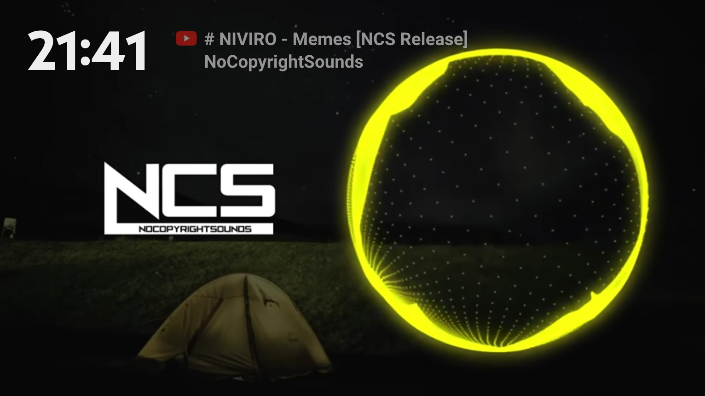

# InfoTube - A Google Chrome Extension




Add digital clock and information of playing video on YouTube

## Overview
This extension is developed for YouTube using as BGV.

The functions is below, and you can switch on and off for using.
- Clock and information
- Clock only
- Information only


## Author
Kazuyoshi Watanabe [LinkedIn](https://www.linkedin.com/in/kazuyoshi-watanabe/)

## For developer
```
flutter doctor
[✓] Flutter (Channel stable, 3.7.3, on macOS 13.0.1 22A400 darwin-arm64, locale en-GB)
[✓] Android toolchain - develop for Android devices (Android SDK version 32.1.0-rc1)
[✓] Xcode - develop for iOS and macOS (Xcode 14.3)
[✓] Chrome - develop for the web
[✓] Android Studio (version 2021.1)
[✓] VS Code (version 1.79.0)
[✓] Connected device (2 available)
[✓] HTTP Host Availability
```
Build project
```
flutter build web --web-renderer html --csp
```
